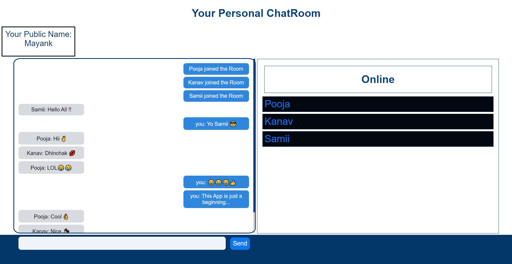

# Chat_Room
Your Personal Chat Room in NodeJS and Socket.io
-------------------------------------------------

## References
* [Sending message to specific a client](https://www.codershood.info/2016/01/24/sending-message-specific-user-socket-io/#:~:text=To%20send%20a%20message%20to,send%20a%20message%20to%20user1.)
